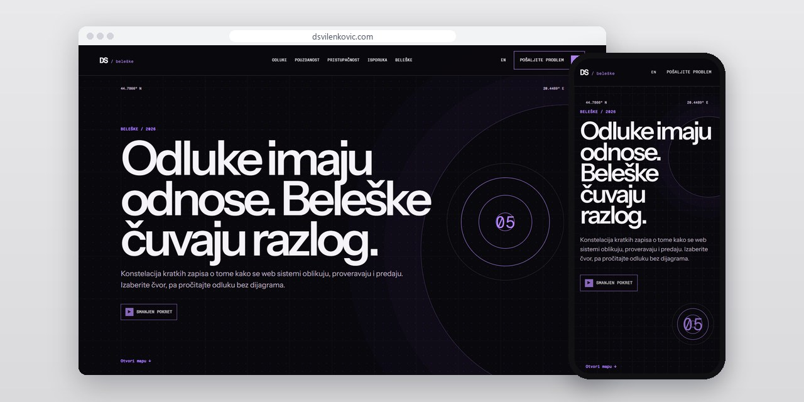
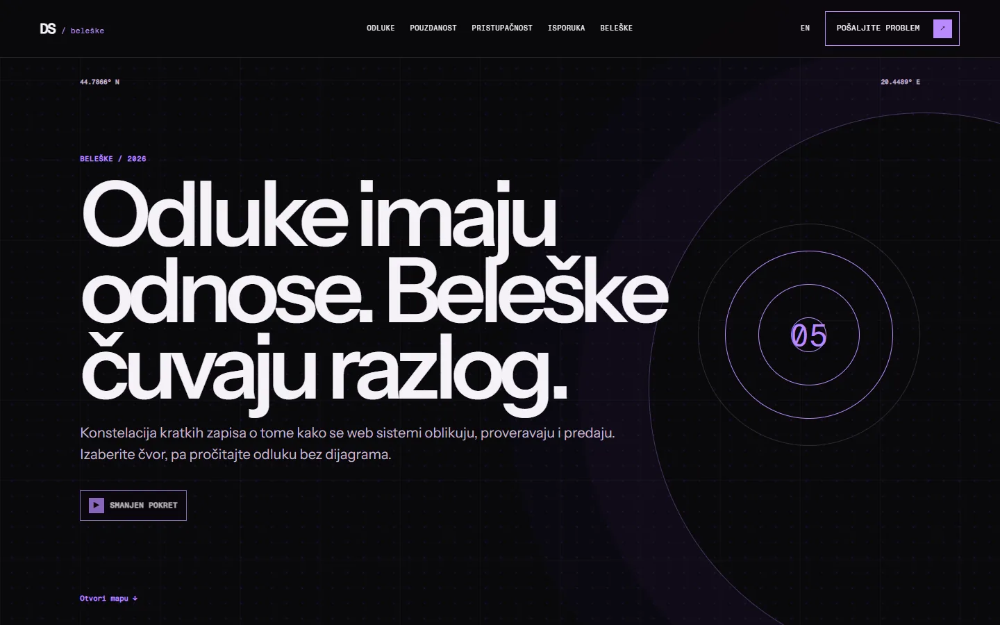
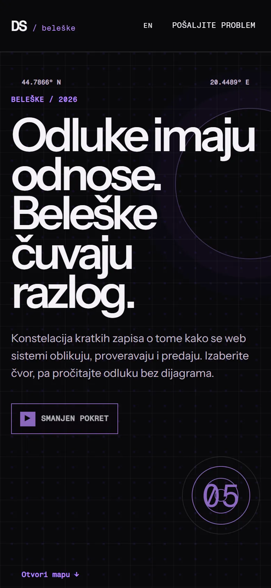
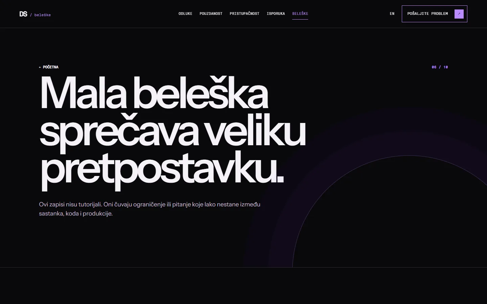

# D. Svilenković Notes

Dvojezična beležnica u kojoj zapisujem zašto je tehnička odluka doneta, šta je provereno i dokle zaključak važi.

**[dsvilenkovic.com](https://dsvilenkovic.com/)** · [Studija slučaja](https://svilenkovic.rs/radovi/d-svilenkovic) · [English](README.md)

> [!NOTE]
> Moj sopstveni projekat, ne klijentski posao. Izvorni kod je privatan. Ova stranica opisuje šta sajt radi i kako je napravljen.

<table>
  <tr><td><b>Klijent</b></td><td>Sopstveni projekat</td></tr>
  <tr><td><b>Delatnost</b></td><td>Tehničke beleške i odluke</td></tr>
  <tr><td><b>Lokacija</b></td><td>Srbija</td></tr>
  <tr><td><b>Vrsta</b></td><td>Sajt sa beleškama</td></tr>
  <tr><td><b>Moj deo posla</b></td><td>Istraživanje, dizajn, izrada, SEO i hosting</td></tr>
  <tr><td><b>Tehnologije</b></td><td>Astro 7, TypeScript, PHP 8.3, SQLite, nginx</td></tr>
</table>

## O projektu

Gotov sajt ne pokazuje uvek zašto je neka odluka doneta. Na dsvilenkovic.com beležim razloge, ograničenja i tačke koje treba ponovo proveriti, da zaključak ne ostane samo u razgovoru ili commit poruci.

Naslovna povezuje beleške u konstelaciju, jer arhitektura, pristupačnost, pouzdanost i isporuka utiču jedna na drugu, a čitalac ulazi kroz problem koji ga zanima. Svaka beleška otvara konkretno pitanje, pa kaže šta je provereno i gde je granica zaključka. Pokret samo pokazuje veze; smisao je u naslovima i tekstu, a strane rade i bez JavaScript-a.

## Šta sam uradio

- Beleške složene oko odluka, sa stranama za arhitekturu, pouzdanost, pristupačnost i isporuku
- Isti obrazac za svaku belešku: pitanje, šta je provereno i granica zaključka
- Navigacija kao konstelacija, a ispod nje obične veze
- Čitljiva slova, vidljiv fokus tastature i podrška za smanjeno kretanje
- Srpska i engleska verzija svake beleške

## Merenja

| | Performanse | Pristupačnost | Dobre prakse | SEO |
| :-- | :-: | :-: | :-: | :-: |
| Telefon | 98 | 100 | 100 | 100 |
| Desktop | 94 | 100 | 100 | 100 |

PageSpeed Insights, laboratorijsko merenje živog sajta, oktobar 2026. Sigurnosna zaglavlja: 6 od 6. axe provera pristupačnosti: bez prekršaja. Strukturisani podaci: `Organization`, `Person`.

## Snimci ekrana

<table>
  <tr>
    <td width="68%" valign="top"></td>
    <td width="32%" valign="top"></td>
  </tr>
</table>

Beleške na živom sajtu

---

Izrada: [D. Svilenković](https://svilenkovic.rs).
